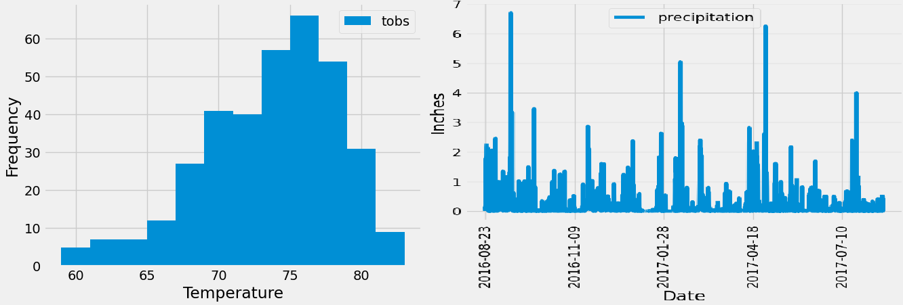
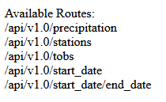

## Honolulu SQLAlchemy Challenge Overview

This project involves designing and implementing a SQL database to manage employee data for Pewlett Hackard, a fictional company. The database is populated with data from CSV files representing employee information from the 1980s and 1990s. The project includes data modeling, data engineering, and data analysis.

Congratulations! You've decided to treat yourself to a long holiday vacation in Honolulu, Hawaii. To help with your trip planning, you decide to do a climate analysis about the area. You're challenge is to combine the powers of SQLAlchemy, Flask, and Matplotlib to complete your weather analysis. 

## Table of Contents

- [Honolulu SQLAlchemy Challenge Overview ](#honoluwai-sqlalchemy-challenge-overview)
- [Challenge Files](#challenge-files)
- [Data Visualizations](#data-visualizations)
- [Flask API](#flask-api)

## Challenge Files

The project includes the following files:

1. `hawaii_measurements.csv` - Contains collected from weather station. (e.g., station, date, prcp, tobs).
2. `hawaii_stations.csv` - Contains station details (e.g., station, name, latitude, longitude).
3. `hawaii.sqlite.csv` - Contains an SQLite database for Flask routes.

## Data Visualizations

Here you can see a histogram and line graph of Hawaii weather.

## Flask API

Flask API with routes that allow you to filter data from the SQLite database using SQLAlchemy.

Homepage of the Hawaii weather data API with available routes:

